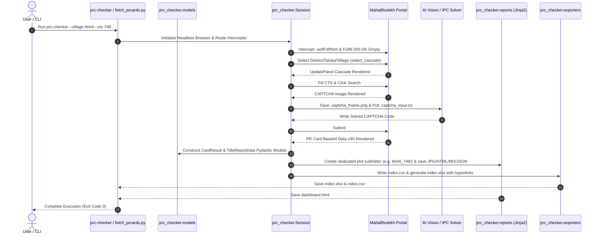

# PRC-Checker Technical Architecture & Protocol Specification

## Component Mapping

```text
PRC-Checker/
├── pyproject.toml         # Packaging, Dependencies & Console Scripts
├── .gitignore             # Repo Guardrails
├── fetch_prcards.py       # Main CLI Entrypoint
├── prc_checker/           # Modular Package Core
│   ├── __init__.py        # Package Init
│   ├── models.py          # Pydantic Data Models (Type Safety & Validation)
│   ├── session.py         # Pure Playwright Browser Driver & Form Interceptor
│   ├── reports.py         # Jinja2 Report, Brief & HTML Renderer
│   ├── artifacts.py       # Disk I/O & Artifact Builder Engine
│   ├── exporters.py       # Master Excel Index (.xlsx), CSV & SQLite Exporters
│   ├── dashboard.py       # Jinja2 Dark-Mode Workspace Builder
│   ├── logger.py          # Structured Logger
│   └── templates/         # Jinja2 Template Files
│       ├── card.html.j2   # HTML Card Template
│       ├── report.md.j2   # 6-Block Title Audit Report Template
│       ├── promoter.md.j2 # Promoter Executive Brief Template
│       ├── lawyer.md.j2   # Lawyer Legal Counsel Brief Template
│       ├── dashboard.html.j2 # Workspace Dashboard Template
│       └── styles.css.j2  # Shared CSS Token Design System
├── tests/                 # Pytest Test Suite
│   ├── __init__.py
│   ├── test_artifacts.py # Artifact Builder Unit Tests
│   ├── test_models.py     # Pydantic Model Tests
│   ├── test_templates.py  # Jinja2 Rendering Tests
│   ├── test_reports.py    # Report & Brief Unit Tests
│   ├── test_exporters.py  # Excel & CSV Exporter Tests
│   └── test_session.py    # Session Driver & Mock Tests
├── prcards/               # Main Output Directory
│   ├── index.xlsx         # Master Excel Index (Hyperlinked)
│   ├── index.csv          # Tabular CSV Index
│   ├── dashboard.html     # Interactive Batch Workspace
│   ├── manifest.json      # Execution Manifest
│   └── <Plot_Folder>/     # Dedicated Per-Plot Query Subfolder (e.g. Worli_748/)
│       ├── propcard_<village>_<cts>.jpg
│       ├── propcard_<village>_<cts>.html
│       ├── propcard_<village>_<cts>.json
│       ├── title_report_propcard_<village>_<cts>.md
│       ├── promoter_brief_propcard_<village>_<cts>.md
│       └── lawyer_brief_propcard_<village>_<cts>.md
├── README.md              # Project Overview & Quick Start Guide
├── HANDOFF.md             # Operational Manual & Handoff Guide
└── ARCHITECTURE.md        # Technical System Specification (This File)
```

---

## Sequence Flow Diagram


